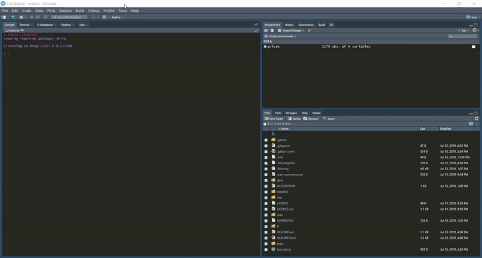

<!-- README.md is generated from README.Rmd. Please edit that file -->

# tsviz

<!-- badges: start -->

[](https://www.tidyverse.org/lifecycle/#experimental)
[](https://travis-ci.org/donlelef/tsviz)
[](https://CRAN.R-project.org/package=tsviz)
[](https://cran.r-project.org/package=tsviz)
[](https://cran.r-project.org/package=tsviz)
<!-- badges: end -->


An RStudio addin to provide easy and interactive time series
visualization. To be visible to the addin, time series must be stored in
a dataframe in the global environment, with:

  - at least a column of type *Date*
  - at least a column of type *numeric*

## Installation

You can install the released version of tsviz from
[CRAN](https://CRAN.R-project.org) with:

``` r
install.packages("tsviz")
```

Or install the development version from Github:

``` r
devtools::install_github("donlelef/tsviz")
```

Once you have installed the package, you do not need to load it with
`library()`, the addins are installed on your machine as part of the
package install process.

## Example

First, let us load some suitable data:

``` r
library(tsviz)
prices <- crypto_prices
```

Then, we can run the addin:



That’s it.
